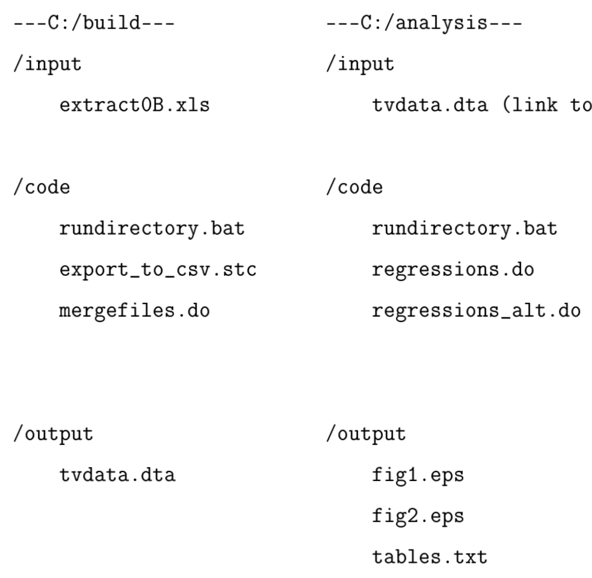
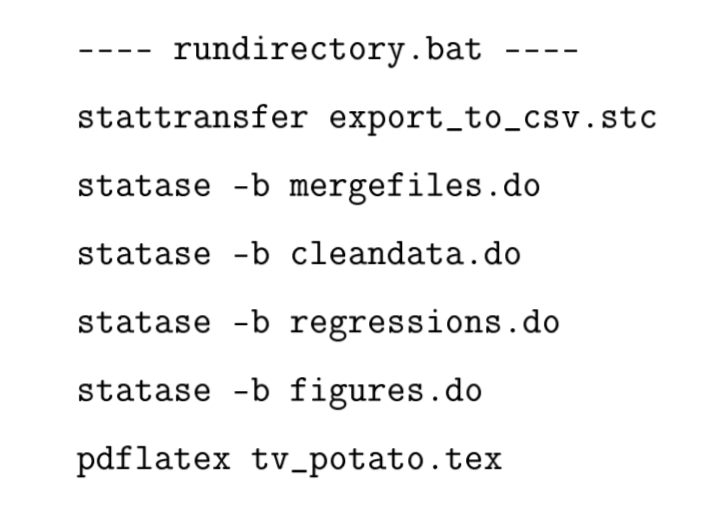

```{r setup, include=FALSE}
knitr::opts_chunk$set(echo = FALSE)
```

## Motivation

Articles get retracted all of the time for not being reproducible

Reproducibility is a foundational principle of the scientific process

Many tools now exist to ensure reproducibility so let's use them

Invest effort up front (even if you only internalize a portion of the dividends)

## Coding

Most of us do or will write code to conduct analyses

Few of us have formal training in code development and management

Given how much time we spend coding, we should invest time in learning how to do it properly and efficiently

See example of situations where proper data and code management can help

## Basic Process

Acquire and process data

Analyze data

Disseminate: write articles, present research

## Project directory

Generally keep projects self contained in a directory

If same base data used for multiple projects, keep a master raw data copy somewhere

Find an organizational structure that works for you

## Organized Directory Structure

```{r, out.width = "600px"}

```

## Automation

Write scripts - do not use in interactive mode

Automate as much as possible for yourself and others

- Reproducibility: script is like a log of your steps

- Efficiency: easy to make changes in the future

Make files - like a recipe for your project

```{r, out.width = "300px"}

```


## Version Control

Have you ever appended "v2" or your initials to a draft?

Version control is like track changes and dropbox for code plus other extras that help develop a code project

Github is my preference because well integrated with RStudio (public and private repositories)

Bad form to store large datasets on their servers + unnecessary since they don't change 

See https://happygitwithr.com/ for how to get started using github

## Data Management

Think through processing from start to finish

Clean datasets as consistently as possible - make ids char/str at beginning

Make data rectangular and keep it that way (tidy)

## Abstraction

Write functions when possible - if repeating a task


## Documentation

Document data sources and steps you take to manipulate the data

Write documentation for others (and your future self) - be as clear as possible

https://github.com/ropensci/drake

## Tools for data management and analysis
| Software | Learning  | Scope | Community  | Cost |
|----------|-----------|-------|------------|------|
| [R](https://en.wikipedia.org/wiki/R_(programming_language))        | moderate  | extensive | large | free |
| [Python](https://en.wikipedia.org/wiki/Python_(programming_language))   | moderate* | extensive | large | free |
| [Julia](https://julialang.org/) | moderate | growing | growing | free |
| [Stata](https://en.wikipedia.org/wiki/Stata)    | easy      | conventional data | econ | high |
| [Matlab](https://en.wikipedia.org/wiki/MATLAB)   | moderate  | extensive | moderate* | high |


Become proficient in one or two

Other considerations: geospatial, computational speed (solvers), estimators


